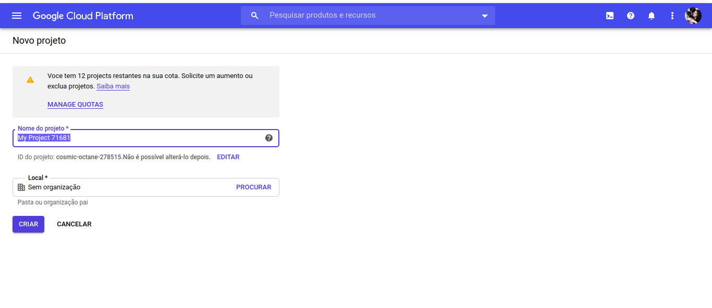
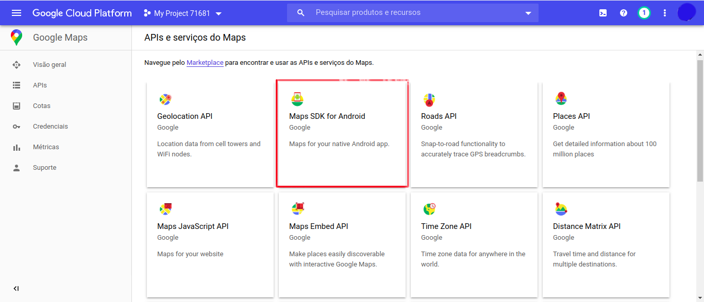
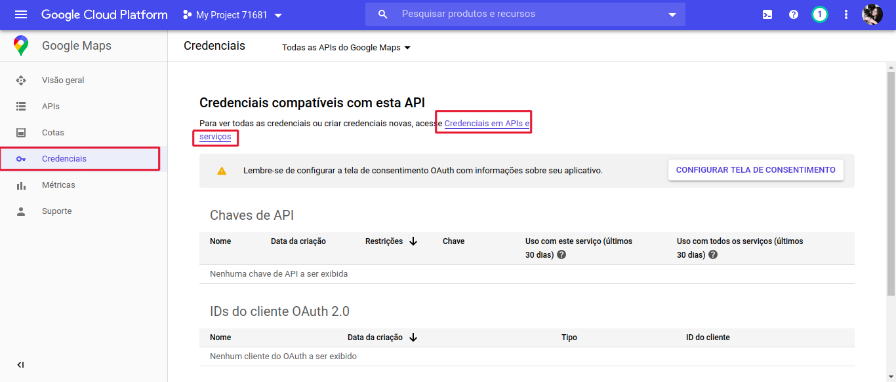
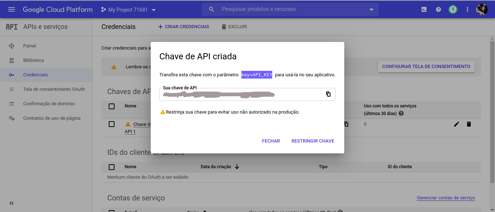
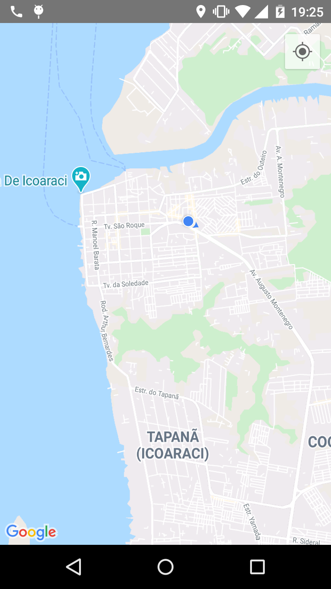
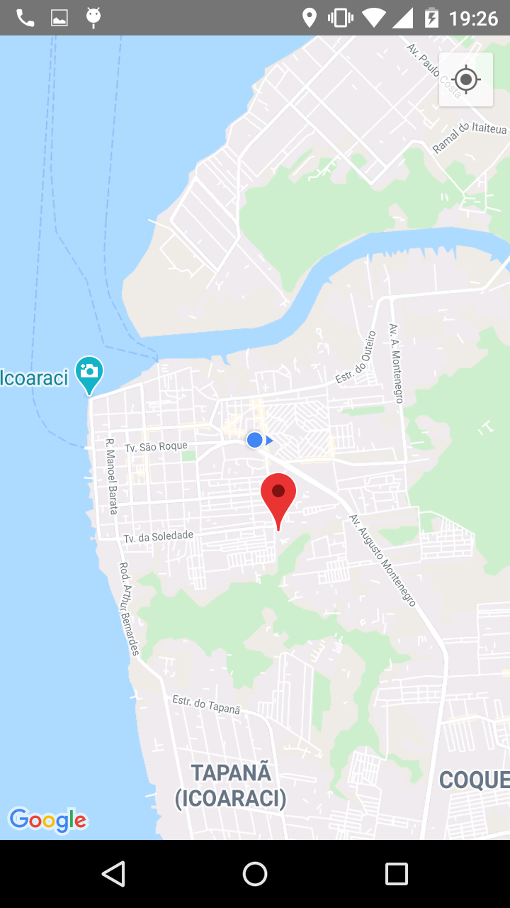

# React Native com mapa e geolocalização

## Tecnologias utilizadas
- React Native
- [react-native-maps](https://github.com/react-native-community/react-native-maps)
- [react-native-geolocation-service](https://github.com/Agontuk/react-native-geolocation-service)

## Preparação
### react-native-maps

Instalamos o pacote através do seguinte comando:

```sh
$ yarn add react-native-geolocation-service
```

Devemos adicionar o seguinte código em `android/app/src/main/AndroidManifest.xml`

``` xml
<application>
   <meta-data
    android:name="com.google.android.geo.API_KEY"
    android:value="Sua API KEY do google maps"/>

  <!-- You will also only need to add this uses-libray tag -->
  <uses-library android:name="org.apache.http.legacy" android:required="false"/>
</application>
```

Para as versões do react native inferiores a 0.60 deve ser realizado o seguinte passo:

> Caso a sua versão seja superior ou igual a 0.60 esse passo torna-se desnecessário

Arquivo: build.gradle

```
ext {
  compileSdkVersion   = 28
  buildToolsVersion   = "28.0.3"
  minSdkVersion       = 16
  targetSdkVersion    = 28

  // Any of the following will work
  googlePlayServicesVersion      = "17.0.0"
  // playServicesVersion         = "17.0.0"
  // playServicesLocationVersion = "17.0.0"
}
```

#### Gerando a chave de API Google Maps

Para realizar esta etapa você precisa ter uma conta no google e precisa acessar o seguinte [endereço](https://cloud.google.com/console/google/maps-apis/overview)

Você deve logar com a sua conta do google. Após o login a seguinte tela será apresentada para você


Aceite os termos e continue.

Selecione a opção **API** no menu lateral e crie um novo projeto, digite o nome do seu projeto



Após criar o seu projeto a seguinte tela será apresentada. Nesse dashboard selecione a opção **Maps SDK for Android** e clique no botão ativar



Após esse passo você deve selecionar a opção **Credenciais** no menu lateral e clicar em *Credenciais em APIs e serviços*



Isso te levará para essa tela onde você irá clicar em **CRIAR CREDENCIAIS**


E logo será criada a sua chave de API




### react-native-geolocation-service

Instalamos o pacote com o comando:

``` sh
$ yarn add react-native-geolocation-service
```

Devemos adicionar as permissões no arquivo `android/app/src/main/AndroidManifest.xml`

```xml
<uses-permission android:name="android.permission.ACCESS_COARSE_LOCATION" />
<uses-permission android:name="android.permission.ACCESS_FINE_LOCATION" />
```

## No Código

Para pegar a localização atual do usuário iremos utilizar o objeto Geolocation do pacote `react-native-geolocation-service`

``` javascript
import Geolocation from 'react-native-geolocation-service';

const App = () => {
const [minhaLocalizacao, setMinhaLocalizacao] = useState({})

useEffect(() => {
    Geolocation.getCurrentPosition(
        (position) => {
          setMinhaLocalizacao({
            latitude: position.coords.latitude,
            longitude: position.coords.longitude,
            latitudeDelta: 0.0922,
            longitudeDelta: 0.0421,
          })
          console.log('minha localização => ', minhaLocalizacao);
        },
        (error) => {
          // See error code charts below.
          console.log(error.code, error.message);
        },
        { enableHighAccuracy: true, timeout: 15000, maximumAge: 10000 }
    );
  }, [])
}
```

Os parâmetros do método `getCurrentPosition(sucesso(), erro(), opções)`

Como estou escrevendo os componentes como funções tive que usar o `useEffect()`, e para que ele execute apenas uma vez é preciso passar um array vazio para que ele se comporte como se estivesse no metodo `componentDidMount`. [Referência da documentação](https://pt-br.reactjs.org/docs/hooks-effect.html#tip-optimizing-performance-by-skipping-effects)

Para utilizar a localização obtida vamos usar o component MapView do pacote `react-native-maps` para renderizar o nosso mapa


``` javascript
import MapView from 'react-native-maps'


const App = () => {
...
   return (
      <>
      <MapView
        region={minhaLocalizacao}
        style={{ width: 360, height: 570}}
        showsUserLocation={true}
        onPress={(position) => getLocalizacao(position.nativeEvent)}
      />
    </>
   )
}

```

Com isso temos um mapa que marca a sua localização inicial.



Se você tirar o atributo `{{ width: 360, height: 570}}` talvez o mapa não apareça.

Podemos também inserir marcadores no mapa utilizando o componente Marker do pacote `react-native-maps`. E utilizar o atributo `onPress` do componente MapView para pegar a localização de onde a pessoa clicou no mapa.

```javascript
import MapView, { Marker } from 'react-native-maps';

<>
      <MapView
        region={minhaLocalizacao}
        style={{ width: 400, height: 500}}
        showsUserLocation={true}
        showsMyLocationButton={true}
        moveOnMarkerPress={true}
        onPress={(position) => getLocalizacao(position.nativeEvent)}
      >
        <Marker
          coordinate={posicaoMarcador}
        />
      </MapView>
    </>
```

O atributo coordinate do componente Marker deve receber um objeto assim:

```javascript
{
   latitude: Number,
   longitude: Number
}
```

Com esse pedaço de código você pode clicar em um ponto qualquer do mapa e ele será marcado como na imagem a seguir



Dado este tutorial agora você terá uma base para inserir mapas no seu aplicativo android.
